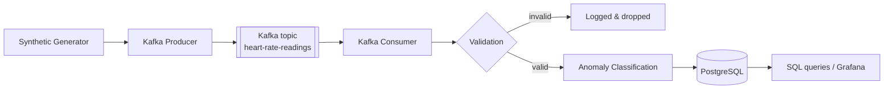

# Real-Time Customer Heart Beat Monitoring System

Generates synthetic heart-rate readings for multiple fake customers, streams them through Apache Kafka, validates and classifies them, and persists them to PostgreSQL for querying and dashboarding.

Python 3.11+ · Kafka (KRaft) via `confluent-kafka` · PostgreSQL 16 via `psycopg` 3 · Pydantic 2 · Grafana · Docker Compose

## Architecture



Detailed diagrams and the reasoning behind each design decision are in [`docs/architecture/architecture.md`](docs/architecture/architecture.md).

## Setup

Requires Python 3.11+ and Docker Desktop running.

```bash
cp .env.example .env          # every value is also the built-in default
make install                  # or: pip install -e ".[dev]"
make up                       # starts Kafka, PostgreSQL, Grafana, Adminer
```

`make up` waits until every container is healthy. The schema and indexes are applied automatically on the first boot of a fresh volume — `make db-init` only exists to re-apply them after `make clean`.

Configuration lives in `.env`; see [`.env.example`](.env.example) for the full list with comments.

## Running the pipeline

Two terminals. Both stop cleanly on `Ctrl+C`.

```bash
make run-producer     # generates events, publishes to Kafka
make run-consumer     # consumes, validates, classifies, writes to PostgreSQL
```

The consumer logs each persisted batch and prints an `ANOMALY` warning for every LOW/HIGH reading.

To preview generated data without any infrastructure: `make run-generator`.

## Dashboard

**<http://localhost:3000>** — no login, and it opens directly on the *Heart Beat Monitoring* dashboard. Grafana runs as part of `make up`.

The datasource and dashboard are provisioned from files in [`grafana/provisioning/`](grafana/provisioning/), never configured by clicking through the UI. That is what makes the dashboard reproducible: version-controlled, reviewable in a diff, and it survives `docker compose down -v`. To keep a change made in the browser, use the dashboard's **Export → Save to file** and commit the JSON.

Adminer, for browsing tables directly, is at <http://localhost:8080> (System: PostgreSQL, Server: `postgres`).

## Querying the data

```bash
make psql             # then: \i sql/queries/recent_readings.sql
```

Prepared queries in [`sql/queries/`](sql/queries/): `recent_readings`, `customer_history`, `anomaly_summary`, `hourly_statistics`.

## Testing

```bash
make test-unit          # 38 tests, no infrastructure needed
make test-integration   # 11 tests, requires `make up`
```

Unit tests cover the generator's ranges and anomaly injection, the event model's timezone contract and JSON round trip, the invalid vs. valid-but-abnormal validation split, and classification threshold boundaries.

Integration tests run real Kafka and PostgreSQL clients with no mocking, so they catch wiring mistakes unit tests structurally cannot see: a published message reaching PostgreSQL correctly classified, duplicate `event_id`s not creating duplicate rows, and a malformed message not blocking subsequent valid ones. They skip rather than fail when the infrastructure is down.

## Troubleshooting

| Symptom | Fix |
|---|---|
| `ModuleNotFoundError: heartbeat_monitoring` | `make install` — the `src/` layout needs the editable install |
| `role "heartbeat_user" does not exist` | The volume was created with older credentials. Postgres only creates the user on a *first* boot, so `make clean && make up` is required — editing `.env` alone won't fix it |
| `relation "heart_rate_readings" does not exist` | `make db-init` |
| Consumer logs nothing | Check the producer is running and `KAFKA_TOPIC` matches on both sides |
| Grafana shows "No data" | No rows in the window — start the pipeline, or widen the time picker |
| Port `5432`, `9092`, `3000` or `8080` in use | Set `POSTGRES_PORT` / `GRAFANA_PORT` in `.env`, or stop the conflicting service |

## Design notes

Full reasoning in [`docs/architecture/architecture.md`](docs/architecture/architecture.md).

- **Invalid ≠ abnormal.** A malformed message is dropped; an *alarming* reading is stored and flagged. Conflating the two would discard exactly the events the system exists to catch.
- **Offsets commit after the database write,** so a crash replays messages rather than losing them — and `ON CONFLICT (event_id) DO NOTHING` makes that replay a no-op.
- **Messages keyed by `customer_id`,** so each customer's readings stay ordered within one partition.
