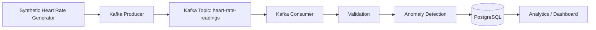

# Real-Time Customer Heart Beat Monitoring System

## Project Overview

This project simulates a real-time heart-rate monitoring system. Instead of connecting to physical wearable devices, it generates synthetic heart-rate readings for multiple fake customers, streams them through Apache Kafka, validates and classifies them, and persists them to PostgreSQL for historical querying and analytics.

It's a learning project focused on understanding how real-time data systems actually work end-to-end — not a tutorial of isolated scripts.

## Objectives

This project demonstrates:
- Synthetic time-series data generation
- Kafka producers and consumers, topic/partition/key design
- A validation layer separated from business-rule (anomaly) classification
- PostgreSQL schema design for time-series-like data, with appropriate indexing
- Idempotent, duplicate-safe database writes under at-least-once delivery semantics
- Structured logging and graceful error handling
- A testing strategy split between infra-free unit tests and infra-dependent integration tests
- Docker Compose for reproducible local infrastructure

## Architecture



See [`docs/architecture/architecture.md`](docs/architecture/architecture.md) for the detailed sequence diagram and the full engineering-decisions log.

## Technologies

- Python 3.11+
- Apache Kafka (KRaft mode, no Zookeeper) via `confluent-kafka`
- PostgreSQL 16 via `psycopg` 3 + `psycopg_pool`
- Pydantic 2 for validation and settings
- pytest for testing
- Docker Compose for local infrastructure
- Streamlit (optional dashboard)

## Repository Structure

```
real-time-heartbeat-monitoring/
├── docker-compose.yml        # Kafka (KRaft) + PostgreSQL for local dev
├── pyproject.toml            # Dependencies and pytest config
├── .env.example              # Configuration template (copy to .env)
├── Makefile                  # install / up / down / test / run targets
│
├── sql/
│   ├── schema/create_tables.sql
│   ├── indexes/create_indexes.sql
│   └── queries/               # recent_readings, customer_history, anomaly_summary, hourly_statistics
│
├── src/heartbeat_monitoring/
│   ├── config/                # Typed Settings (single source of env vars)
│   ├── models/                # HeartRateEvent schema
│   ├── generator/              # Pure synthetic data generation functions
│   ├── producer/                # Kafka producer wrapper
│   ├── consumer/                # Kafka consumer wrapper (orchestrates the pipeline)
│   ├── validation/              # Structural validation (invalid vs. valid-but-abnormal)
│   ├── processing/              # Anomaly classification (business rule, not medical)
│   ├── database/                # Connection pool + repository (only place SQL lives)
│   └── utils/                   # Logging configuration
│
├── scripts/
│   ├── run_generator.py        # Preview generated events without Kafka
│   ├── run_producer.py         # Continuous generate + publish loop
│   └── run_consumer.py         # Consume + validate + classify + persist loop
│
├── dashboard/app.py            # Optional Streamlit dashboard (read-only, decoupled)
│
├── tests/
│   ├── unit/                   # No infrastructure required
│   └── integration/            # Requires Docker Compose running
│
└── docs/architecture/architecture.md   # Diagrams + engineering decisions
```

## Data Flow

```
Generate → Produce → Stream (Kafka) → Consume → Validate → Classify → Store (PostgreSQL) → Analyze / Dashboard
```

## Prerequisites

- Python 3.11+
- Docker and Docker Compose
- `pip`

## Configuration

Copy the template and adjust as needed:

```bash
cp .env.example .env
```

Key variables (full list in `.env.example`):

| Variable | Purpose |
|---|---|
| `NUMBER_OF_CUSTOMERS` | How many simulated customers the generator produces for |
| `GENERATION_INTERVAL_SECONDS` | Delay between generation rounds |
| `MIN_HEART_RATE` / `MAX_HEART_RATE` | Bounds of the "plausible normal" generated range |
| `ANOMALY_PROBABILITY` | Chance any given reading is generated as an outlier |
| `ANOMALY_LOW_THRESHOLD` / `ANOMALY_HIGH_THRESHOLD` | Business-rule thresholds used to classify `status` |
| `KAFKA_BOOTSTRAP_SERVERS`, `KAFKA_TOPIC`, `KAFKA_CLIENT_ID`, `KAFKA_CONSUMER_GROUP` | Kafka connection/topic config |
| `POSTGRES_HOST`, `POSTGRES_PORT`, `POSTGRES_DB`, `POSTGRES_USER`, `POSTGRES_PASSWORD` | Database connection config |

`.env` is git-ignored; never commit it. `.env.example` contains only placeholders.

## Installation

```bash
python -m venv .venv && source .venv/bin/activate   # optional but recommended
make install
```

## Infrastructure Setup

```bash
make up      # starts Kafka (KRaft mode) and PostgreSQL
```

Check both are healthy:

```bash
docker compose ps
```

## Database Setup

Apply the schema and indexes:

```bash
make db-init
```

## Running the Producer

```bash
make run-producer
```

This continuously generates events for all configured customers and publishes them to the `heart-rate-readings` topic. Stop with `Ctrl+C` for a graceful shutdown (flushes in-flight messages).

To preview generated data without touching Kafka at all:

```bash
make run-generator
```

## Running the Consumer

In a separate terminal:

```bash
make run-consumer
```

This consumes from Kafka, validates and classifies each message, and writes valid readings to PostgreSQL. Stop with `Ctrl+C` for a graceful shutdown.

## Verifying Data

```bash
make psql
```

Then, inside `psql`, or via any SQL file in `sql/queries/`:

```sql
SELECT * FROM heart_rate_readings ORDER BY reading_time DESC LIMIT 20;

SELECT status, COUNT(*) FROM heart_rate_readings GROUP BY status;
```

## Testing

```bash
make test-unit          # fast, no infrastructure needed — 29 tests
make test-integration   # requires `make up` and `make db-init` first
```

Unit tests cover: generator behavior, event model validation, structural validation (invalid vs. valid-but-abnormal), anomaly classification boundaries, and configuration loading.

Integration tests cover: a published message actually reaching PostgreSQL, duplicate `event_id`s not creating duplicate rows, and a malformed message not blocking subsequent valid ones. They spin up real `confluent-kafka` and `psycopg` clients against the Docker infra — no mocking — so they catch wiring mistakes unit tests can't see.

## Troubleshooting

| Symptom | Likely cause |
|---|---|
| `ModuleNotFoundError: heartbeat_monitoring` | Run `make install` (editable install required for the `src/` layout) |
| Port `5432` or `9092` already in use | Something else on your machine is bound to that port; stop it or remap ports in `docker-compose.yml` |
| Consumer logs nothing | Check the producer is actually running and check `KAFKA_TOPIC` matches on both sides |
| `psycopg.OperationalError: connection refused` | Postgres isn't up yet — wait for `docker compose ps` to show healthy, or re-run `make up` |
| Integration tests hang or fail | Confirm `make up` succeeded and `make db-init` was run against a fresh schema |

## Optional Dashboard

```bash
pip install -e ".[dashboard]"
make dashboard
```

Opens a Streamlit app reading directly (read-only) from PostgreSQL: current summary metrics, a recent-readings table, per-customer heart-rate history, and anomaly rate by customer. It is fully decoupled from the ingestion pipeline — it never imports producer/consumer code and never writes to the database.

## Future Improvements

- Dead-letter topic for unprocessable messages (currently logged only)
- Schema registry + Avro for safe schema evolution
- Batch database writes for higher throughput
- Prometheus/Grafana metrics beyond structured logs
- Multiple consumer instances demonstrating horizontal scaling within the consumer group
- Cloud deployment considerations (managed Kafka, managed Postgres)
- Configurable plausible-timestamp-window validation (reject far-future/far-past readings)
