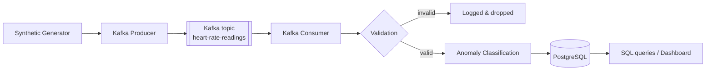

# Real-Time Customer Heart Beat Monitoring System

## Project Overview

This project simulates a real-time heart-rate monitoring system. Instead of connecting to physical wearable devices, it generates synthetic heart-rate readings for multiple fake customers, streams them through Apache Kafka, validates and classifies them, and persists them to PostgreSQL for historical querying and analytics.

It's a learning project focused on understanding how real-time data systems actually work end-to-end — not a tutorial of isolated scripts.

## Objectives

This project demonstrates:
- Synthetic time-series data generation
- Kafka producers and consumers, topic/partition/key design
- A validation layer separated from business-rule (anomaly) classification
- PostgreSQL schema design for time-series-like data, with appropriate indexing
- Idempotent, duplicate-safe database writes under at-least-once delivery semantics
- Structured logging and graceful error handling
- A testing strategy split between infra-free unit tests and infra-dependent integration tests
- Docker Compose for reproducible local infrastructure

## Architecture



Full diagrams and the engineering-decisions log are in [`docs/architecture/architecture.md`](docs/architecture/architecture.md). The exportable deliverable diagram is [`docs/architecture/data_flow_diagram.md`](docs/architecture/data_flow_diagram.md).

## Technologies

- Python 3.11+
- Apache Kafka (KRaft mode, no Zookeeper) via `confluent-kafka`
- PostgreSQL 16 via `psycopg` 3 + `psycopg-pool`
- Pydantic 2 for validation and typed settings
- pytest and ruff
- Docker Compose for local infrastructure
- Streamlit for the dashboard

## Repository Structure

```
Heart_Beat_Monitoring_System/
├── docker-compose.yml          # Kafka (KRaft) + PostgreSQL + Adminer
├── pyproject.toml              # Dependencies, pytest and ruff config
├── .env.example                # Configuration template (copy to .env)
├── Makefile                    # install / up / db-init / run-* / test targets
│
├── sql/
│   ├── init.sql                # Container bootstrap (runs schema + indexes)
│   ├── schema/create_tables.sql
│   ├── indexes/create_indexes.sql
│   └── queries/                # recent_readings, customer_history,
│                               #   anomaly_summary, hourly_statistics
│
├── src/heartbeat_monitoring/
│   ├── config/                 # Typed Settings — the only reader of env vars
│   ├── models/                 # HeartRateEvent (wire) + HeartRateReading (storage)
│   ├── generator/              # Pure synthetic data generation
│   ├── producer/               # Kafka producer wrapper
│   ├── consumer/               # Kafka consumer — orchestrates the pipeline
│   ├── validation/             # Structural validation (invalid vs. valid-but-abnormal)
│   ├── processing/             # Anomaly classification (business rule, not medical)
│   ├── database/               # Connection pool + repository (only place SQL lives)
│   └── utils/                  # Logging configuration
│
├── scripts/
│   ├── run_generator.py        # Preview generated events, no Kafka needed
│   ├── run_producer.py         # Continuous generate + publish loop
│   └── run_consumer.py         # Consume + validate + classify + persist loop
│
├── dashboard/app.py            # Streamlit dashboard (read-only)
│
├── tests/
│   ├── unit/                   # No infrastructure required
│   └── integration/            # Requires Docker Compose running
│
└── docs/
    ├── architecture/           # Diagrams + engineering decisions
    └── screenshots/            # Evidence of a run (see its README)
```

## Data Flow

```
Generate → Produce → Stream (Kafka) → Consume → Validate → Classify → Store (PostgreSQL) → Analyze / Dashboard
```

## Prerequisites

- Python 3.11+
- Docker Desktop, running
- `make` — optional; every target's underlying command is shown alongside it below

## Configuration

Copy the template and adjust as needed:

```bash
cp .env.example .env
```

Every value in the template is also the built-in default, so an unedited copy works against the stock Docker stack.

| Variable | Purpose | Default |
|---|---|---|
| `NUMBER_OF_CUSTOMERS` | How many simulated customers the generator produces for | `5` |
| `GENERATION_INTERVAL_SECONDS` | Delay between generation rounds | `1.0` |
| `MIN_HEART_RATE` / `MAX_HEART_RATE` | Bounds of the "plausible normal" generated range | `55` / `100` |
| `ANOMALY_PROBABILITY` | Chance any given reading is generated as an outlier | `0.05` |
| `ANOMALY_LOW_THRESHOLD` / `ANOMALY_HIGH_THRESHOLD` | Business-rule thresholds used to classify `status` | `50` / `120` |
| `KAFKA_BOOTSTRAP_SERVERS`, `KAFKA_TOPIC`, `KAFKA_CLIENT_ID`, `KAFKA_CONSUMER_GROUP` | Kafka connection/topic config | `localhost:9092`, `heart-rate-readings`, … |
| `POSTGRES_HOST`, `POSTGRES_PORT`, `POSTGRES_DB`, `POSTGRES_USER`, `POSTGRES_PASSWORD` | Database connection config | `localhost`, `5432`, `heartbeat_monitoring`, … |
| `LOG_LEVEL` | `DEBUG` / `INFO` / `WARNING` / `ERROR` | `INFO` |

 `.env.example` contains only placeholders.


## Installation

```bash
make install
```

Or directly: `pip install -e ".[dev,dashboard]"`. The editable install is required — the `src/` layout means `import heartbeat_monitoring` only resolves once the package is installed.

## Infrastructure Setup

```bash
make up      # or: docker compose up -d --wait
```

`--wait` blocks until both healthchecks pass. Confirm with:

```bash
docker compose ps
```

## Database Setup

Apply the schema and indexes:

```bash
make db-init
```

The compose file also applies `sql/init.sql` automatically on the *first* boot of a fresh volume. `make db-init` is idempotent, so running it either way is safe.

## Running the Producer

```bash
make run-producer      # or: python scripts/run_producer.py
```

This continuously generates events for all configured customers and publishes them to the `heart-rate-readings` topic. Stop with `Ctrl+C` for a graceful shutdown that flushes in-flight messages.

To preview generated data without touching Kafka at all:

```bash
make run-generator
```

## Running the Consumer

In a separate terminal:

```bash
make run-consumer      # or: python scripts/run_consumer.py
```

This consumes from Kafka, validates and classifies each message, and writes valid readings to PostgreSQL. It logs every persisted batch and prints an `ANOMALY` warning for each LOW/HIGH reading. Stop with `Ctrl+C` — the buffered batch is flushed and offsets committed before exit.

## Verifying Data

```bash
make psql
```

Then, inside `psql`, or via any SQL file in `sql/queries/`:

```sql
SELECT * FROM heart_rate_readings ORDER BY reading_time DESC LIMIT 20;

SELECT status, COUNT(*) FROM heart_rate_readings GROUP BY status;
```

Prepared queries: `recent_readings`, `customer_history`, `anomaly_summary`, `hourly_statistics`. Adminer is also available at <http://localhost:8080> (System: PostgreSQL, Server: `postgres`).

## Testing

```bash
make test-unit          # 38 tests, no infrastructure needed
make test-integration   # 11 tests, requires `make up` and `make db-init` first
```

Unit tests cover: the generator's ranges and anomaly injection, the event model's timezone contract and JSON round trip, the invalid vs. valid-but-abnormal validation split, classification threshold boundaries, and the cross-field configuration rules.

Integration tests cover: a published message reaching PostgreSQL correctly classified, duplicate `event_id`s not creating duplicate rows, and a malformed message not blocking subsequent valid ones. They run real `confluent-kafka` and `psycopg` clients against the Docker infra — no mocking — so they catch wiring mistakes unit tests can't see. They **skip** rather than fail when the infrastructure is absent, so `make test-unit` stays usable offline.

## Troubleshooting

| Symptom | Likely cause |
|---|---|
| `ModuleNotFoundError: heartbeat_monitoring` | Run `make install` (editable install required for the `src/` layout) |
| `docker: failed to connect to the docker API` | Docker Desktop isn't running |
| `relation "heart_rate_readings" does not exist` | Run `make db-init` |
| `psycopg.OperationalError: connection refused` | Postgres isn't up yet — wait for `docker compose ps` to show healthy, or re-run `make up` |
| Consumer logs nothing | Check the producer is actually running and that `KAFKA_TOPIC` matches on both sides |
| Consumer connects to the wrong database | Stale `.env` — re-copy from `.env.example` (see the upgrade note above) |
| Port `5432`, `9092`, or `8080` already in use | Stop the conflicting service, or remap the port in `docker-compose.yml` |
| Integration tests all skip | Infrastructure is down — run `make up` and `make db-init` |

## Dashboard

```bash
make dashboard         # or: streamlit run dashboard/app.py
```

Opens a Streamlit app reading directly (read-only) from PostgreSQL: current summary metrics, a recent-readings table, per-customer heart-rate history, status breakdown, and anomaly rate by customer. It is fully decoupled from the ingestion pipeline — it never imports producer/consumer code and never writes to the database.

## Design Highlights

Reasoning for each is in [`docs/architecture/architecture.md`](docs/architecture/architecture.md).

- **Invalid ≠ abnormal.** A malformed message is dropped; an *alarming* reading is stored and flagged. Conflating the two would discard exactly the events the system exists to catch.
- **Offsets commit after the database write.** A crash replays messages rather than losing them, and `ON CONFLICT (event_id) DO NOTHING` makes that replay a no-op — effectively exactly-once storage with no distributed transaction.
- **Messages keyed by `customer_id`,** so each customer's readings stay chronologically ordered within one partition.
- **Event time and processing time are both stored,** so a late arrival stays distinguishable from a genuinely old reading.
- **Randomness is injected, not global,** which makes the generator's statistical behaviour deterministically testable.
