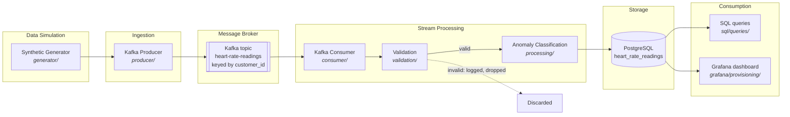
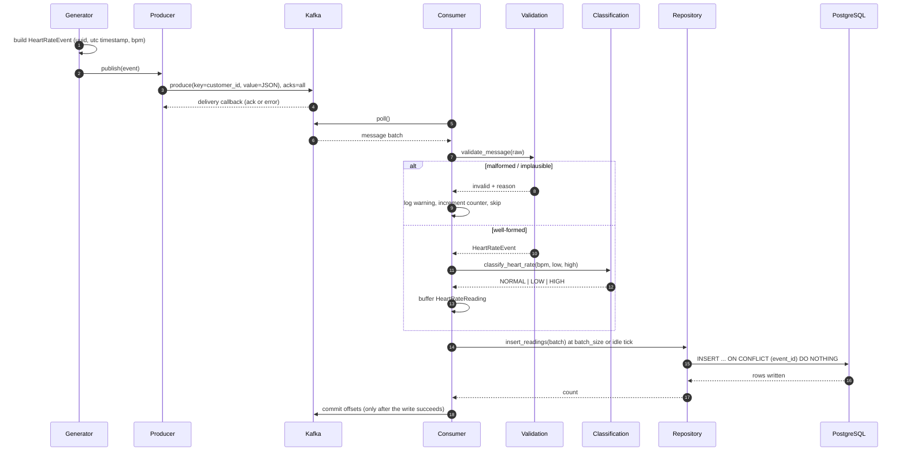
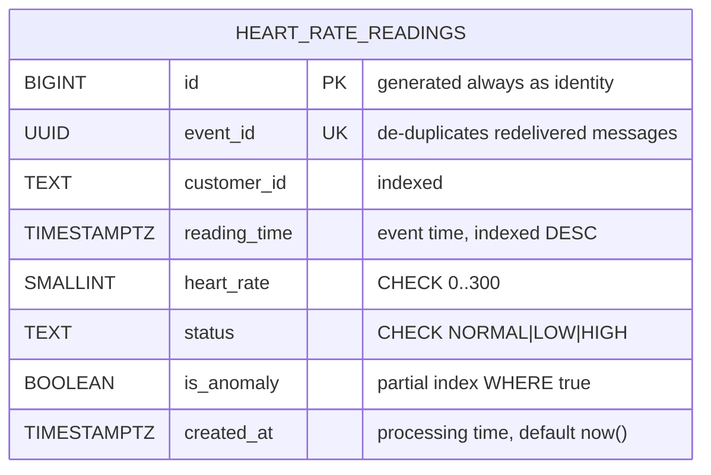

# System Architecture

Diagrams and the engineering-decisions log for the Real-Time Customer Heart
Beat Monitoring System.

All diagrams below are Mermaid, so they render directly on GitHub and stay in
version control as text — a diff on the architecture shows up in code review
instead of being buried in a binary export. For submission, export
[`data_flow_diagram.md`](data_flow_diagram.md) to PNG/PDF via the Mermaid Live
Editor (see that file's header).

---

## 1. Component Overview

## 2. Message Lifecycle

## 3. Database Schema

---

## Engineering Decisions

### Why validation and classification are separate modules

The distinction they encode is the one thing most easily got wrong in this
kind of pipeline:

| | Meaning | Action |
|---|---|---|
| **Invalid** | Not a usable reading: malformed JSON, missing field, naive timestamp, or a physiologically impossible value (< 20 or > 250 bpm) | Log and drop |
| **Valid but abnormal** | A well-formed reading that records an alarming heart rate | **Store, flagged** |

Collapsing these into one "filter out bad heart rates" step is the classic
bug: it discards precisely the events a monitoring system exists to catch.
`validation/` answers *is this a reading at all?*; `processing/` answers *what
does this reading mean?* Two questions, two modules, tested separately.

### Why offsets are committed after the database write

Auto-commit is disabled. The consumer writes a batch to PostgreSQL and only
then commits offsets.

- Committing **before** the write: a crash in between loses those readings permanently.
- Committing **after** the write: a crash in between *replays* them.

Replay is the recoverable failure, so it is the one we choose. `event_id` is
`UNIQUE` and the insert is `ON CONFLICT (event_id) DO NOTHING`, which makes
the replay a no-op. At-least-once delivery plus an idempotent write gives
effectively exactly-once storage without distributed transactions.

### Why messages are keyed by `customer_id`

Kafka guarantees ordering only within a partition. Keying by `customer_id`
puts all of one customer's readings on one partition, preserving their
chronological order — which is the whole point of per-customer monitoring.
Keying by `event_id` would spread a customer's history across every partition
and lose that guarantee, while giving nothing back.

### Why `reading_time` and `created_at` are both stored

Event time and processing time answer different questions. Keeping only one
makes it impossible to tell a genuinely old reading from one that arrived
late — the distinction any late-data or backfill investigation starts from.

### Why the indexes are what they are

| Index | Serves |
|---|---|
| `(customer_id, reading_time DESC)` | The dominant query: recent history for one customer. Composite, so one index scan answers it |
| `(reading_time DESC)` | Cross-customer "latest readings" feeds |
| `(customer_id)` | A customer's full history irrespective of order |
| `(is_anomaly) WHERE is_anomaly` | Partial — anomalies are a few percent of rows, so this index stays small and cheap while fully serving anomaly dashboards |

### Why the generator injects deliberate anomalies

At `ANOMALY_PROBABILITY = 0.05`, one reading in twenty is generated outside
the plausible range. Without them, classification and alerting would never
execute during a demo run — the most interesting half of the pipeline would be
untested dead code. Anomalies are generated inside the *storable* band
(25–45 and 130–200 bpm), distinct from the implausible values validation
rejects, so both paths are exercised.

### Why randomness is injected rather than global

Every generator function takes a `random.Random` instance instead of calling
the `random` module singleton. Seeded RNGs make the generator's statistical
behaviour deterministically testable — `test_generator.py` asserts the actual
anomaly rate lands near the configured probability — with no global patching.

### Why a connection pool rather than one connection

A single connection held open for a long-running consumer is a liability: one
network blip leaves it permanently broken and every later insert fails. The
pool transparently replaces dead connections. `Database.open()` also waits for
a live connection at startup, so a misconfigured database fails fast with a
clear error instead of surfacing hours into a run.

### Why writes are batched

One INSERT per message spends most of its time in network round trips rather
than in the database. The consumer buffers up to `batch_size` readings and
flushes on a full buffer *or* an idle poll — so low-throughput data is never
stranded in the buffer waiting for a batch that will not fill.

### Why Kafka runs in KRaft mode, not Zookeeper

The brief mentions Zookeeper, but Zookeeper was removed from Kafka in 4.0 and
KRaft has been production-default since 3.3. A single-broker KRaft setup is
both the current standard and one less container to keep healthy locally. The
trade-off is that older Kafka tutorials showing `zookeeper:2181` will not
match this compose file.

### Why Grafana, and why it is provisioned as code

Grafana reads PostgreSQL directly. It shares no code with the pipeline, runs in
its own container, and issues only SELECTs — so it cannot corrupt the data it
exists to observe, and a crash in the dashboard can never stop ingestion.

Both the datasource and the dashboard are provisioned from files in
`grafana/provisioning/`, never configured by clicking through the UI. That is
what makes the dashboard reproducible: it is version-controlled, reviewable in
a diff, identical on every machine, and it survives `docker compose down -v`. A
dashboard that exists only inside a Grafana volume is undeployable and
unreviewable — and it disappears the first time someone resets their stack.

The datasource points at `postgres:5432`, deliberately *not* `$POSTGRES_PORT`.
That variable is the host port mapping, which can be remapped to dodge a local
conflict; inside the compose network Postgres is always on 5432.

### Trade-offs accepted

- **Anomaly thresholds are global, not per-customer.** 45 bpm is normal for a
  trained athlete and alarming for someone else. Proper detection needs a
  per-customer clinical baseline; this system applies one configurable global
  rule and says so in the schema comment rather than implying medical meaning.
- **Invalid messages are logged, not dead-lettered.** A dead-letter topic is
  the production answer; at this scale, structured logs are enough to see what
  was rejected and why.
- **JSON on the wire, no schema registry.** Readable and dependency-free for a
  learning project. Avro plus a registry would be the answer once independently
  deployed producers and consumers must evolve safely.
- **Single consumer instance.** The consumer group is configured correctly for
  horizontal scaling, but the demo runs one instance; more partitions would be
  needed for it to help.

---

## Failure Modes

| Failure | Behaviour | Recovery |
|---|---|---|
| Malformed message | Logged, counted as `invalid`, skipped | Automatic — one poison record cannot stall the partition |
| Broker unreachable at startup | Producer/consumer logs and exits non-zero | Restart after `make up` |
| Broker fails mid-run | Delivery callback logs the failure; `acks=all` + idempotence prevents silent loss | Producer retries (5×) |
| Producer queue full | Flushes and retries once rather than dropping | Automatic |
| Postgres unreachable at startup | Consumer logs a pointed error and exits non-zero | Restart after `make up` |
| Postgres write fails mid-batch | Transaction rolls back, offsets are *not* committed | Messages replay on restart; `ON CONFLICT` makes it safe |
| Consumer killed (Ctrl+C / SIGTERM) | Buffered batch flushed, offsets committed, group left cleanly | Resumes from the last committed offset |
| Duplicate delivery | `ON CONFLICT (event_id) DO NOTHING` | No duplicate row |
