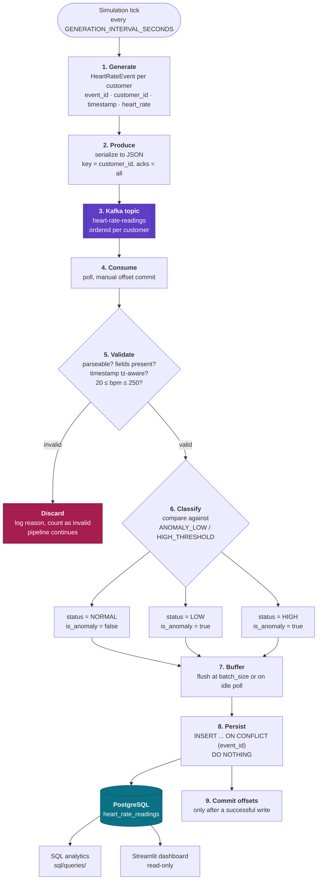

# Data Flow Diagram

The deliverable data-flow diagram, kept on its own so it can be exported
cleanly as an image.

**To export as PNG or PDF:** paste the block below into
<https://mermaid.live>, then *Actions → PNG* / *SVG*. Save the result next to
this file as `data_flow_diagram.png` and it will render inline in the README.
(A Mermaid diagram is also valid draw.io input: *Arrange → Insert → Advanced →
Mermaid*.)

## Reading the diagram

| Step | Module | Guarantee it provides |
|---|---|---|
| 1 Generate | `generator/` | Every emitted event is structurally valid, including deliberate anomalies |
| 2 Produce | `producer/` | `acks=all` + idempotence: no silent message loss |
| 3 Kafka | — | Per-customer ordering, via `customer_id` as partition key |
| 4 Consume | `consumer/` | At-least-once delivery; offsets under our control |
| 5 Validate | `validation/` | Unusable data never reaches storage; **alarming data does** |
| 6 Classify | `processing/` | Every stored reading carries a status |
| 7 Buffer | `consumer/` | Throughput without stranding low-volume data |
| 8 Persist | `database/` | Idempotent write — replay cannot duplicate rows |
| 9 Commit | `consumer/` | Crash before this point replays rather than loses |
